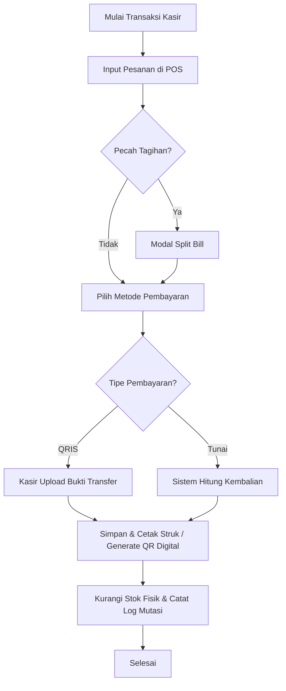

# Buku Panduan Sistem POS Library Cafe UMS Library & Analisis Inventori

Dokumen ini merupakan buku panduan operasional langkah-demi-langkah (*user manual*) lengkap untuk seluruh fitur dalam aplikasi POS Library Cafe UMS Library dan analisis persediaan Library Cafe UPT Perpustakaan Universitas Muhammadiyah Surakarta. Panduan ini dibagi berdasarkan peran pengguna (**Kasir**, **Admin**, dan **Finance**), serta dilengkapi dengan rancangan tata letak gambar pendukung.

---

# BAB 1: PENDAHULUAN

## 1.1 Tujuan Pembuatan Dokumen
Dokumen petunjuk penggunaan aplikasi (*user manual*) ini dibuat dengan tujuan untuk memberikan gambaran umum, petunjuk operasional, dan panduan teknis bagi seluruh pengguna (Kasir, Admin, dan Finance) dalam menjalankan **Sistem POS Library Cafe UMS Library & Analisis Inventori** secara maksimal. Dengan dipahaminya pengoperasian sistem ini, diharapkan proses transaksi penjualan harian, pengelolaan stok menu/produk dagangan, audit kas, dan analisis persediaan dapat berjalan lebih cepat, efisien, serta meminimalisir kesalahan operasional (*human error*).

## 1.2 Deskripsi Umum Sistem
POS Library Cafe UMS Library adalah aplikasi Point of Sale (POS) berbasis web terintegrasi yang digunakan oleh UPT Perpustakaan dan Layanan Digital Universitas Muhammadiyah Surakarta untuk mengelola operasional Library Cafe. Sistem ini dirancang untuk mempercepat transaksi kasir, mengelola inventori produk dagangan/menu, melacak mutasi stok, serta menyediakan panel admin lengkap bagi operator dan administrator cafe. Sistem ini memfasilitasi transaksi penjualan kasir (POS) yang cepat (mendukung struk digital QR dan split bill), manajemen mutasi stok terperinci (inbound & adjustment), pencatatan arus kas non-POS, laporan margin laba berjalan, serta analitik inventori mutakhir menggunakan metode klasifikasi ABC-XYZ untuk menetapkan kebijakan pengadaan stok barang.

## 1.3 Deskripsi Dokumen
Dokumen ini disusun secara terstruktur dengan sistematika sebagai berikut:
1. **Bab 1: Pendahuluan**: Berisi informasi umum yang meliputi tujuan pembuatan dokumen, deskripsi umum sistem, dan deskripsi dokumen.
2. **Bab 2: Kebutuhan Sumber Daya**: Berisikan informasi spesifikasi perangkat minimal yang dibutuhkan untuk menjalankan aplikasi, meliputi perangkat lunak (*software*), perangkat keras (*hardware*), jaringan internet, dan kualifikasi sumber daya manusia.
3. **Bab 3: Overview Sistem**: Berisi rincian mengenai profil aplikasi seperti versi, deskripsi singkat, tujuan pengembangan, permasalahan yang diselesaikan, dan pembagian hak akses pengguna.
4. **Bab 4: Rancang Bangun Aplikasi (Arsitektur & Database)**: Menjelaskan arsitektur perangkat lunak, tumpukan teknologi (*tech stack*), skema tabel database, analisis kebutuhan fungsional/non-fungsional, serta alur proses bisnis (*workflow*).
5. **Bab 5: Pengujian Sistem**: Menyediakan tabel skenario pengujian (*test case*) fitur utama sistem untuk menjamin keandalan fungsionalitas aplikasi.
6. **Bab 6: Keamanan Sistem**: Menjabarkan mekanisme perlindungan data sistem meliputi autentikasi aman, perlindungan CSRF, dan pencegahan XSS.
7. **Bab 7: Instalasi & Konfigurasi Sistem**: Berisi panduan teknis pemasangan (*deployment*) aplikasi pada server lokal maupun production serta konfigurasi web server.
8. **Bab 8: Panduan Visual & Identitas Branding**: Menjelaskan palet warna (*color palette*) resmi sistem yang digunakan sebagai acuan penyusunan elemen visual dan desain dokumen.
9. **Bab 9: Panduan Modul Kasir**: Langkah-langkah detail pengoperasian sistem oleh staf Kasir.
10. **Bab 10: Panduan Modul Admin**: Langkah operasional terlengkap untuk Admin, mengelola seluruh master data, inventori, laporan penjualan, laporan kasir, laporan stok/keuntungan, dan akun staf.
11. **Bab 11: Panduan Modul Finance**: Panduan penggunaan bagi tim Keuangan/Finance untuk dashboard keuangan dan analisis klasifikasi stok.
12. **Bab 12: Panduan Log Aktivitas (Audit Trail)**: Panduan memantau aktivitas perubahan data untuk keamanan internal.

---

# BAB 2: KEBUTUHAN SUMBER DAYA

## 2.1 Perangkat Lunak Pendukung
Untuk dapat mengakses dan menjalankan aplikasi **Sistem POS Library Cafe UMS Library**, perangkat pengguna harus terinstal perangkat lunak sebagai berikut:
1. **Sistem Operasi (OS)**: Windows 10/11, macOS, Linux, Android, atau iOS (Sistem dirancang responsif sehingga ramah digunakan pada tablet/iPad kasir).
2. **Web Browser**: Google Chrome, Mozilla Firefox, Apple Safari, Opera, atau Microsoft Edge versi terbaru (disarankan browser dengan JavaScript dan CSS dalam kondisi aktif).

## 2.2 Perangkat Keras Pendukung
Spesifikasi perangkat keras (*hardware*) minimum pada komputer, laptop, atau tablet untuk mengakses aplikasi dengan lancar adalah:
1. **Processor**: Dual Core 1.8 GHz atau lebih tinggi.
2. **Kapasitas RAM**: Minimal 2 GB (Disarankan 4 GB untuk kelancaran pemuatan dashboard analitik grafik).
3. **Penyimpanan (Storage)**: Minimal 1 GB ruang penyimpanan bebas pada perangkat klien.
4. **Layar / Monitor**: Resolusi layar minimal 1024x768 piksel (tablet 10 inci atau layar PC desktop sangat disarankan untuk kenyamanan tampilan keranjang POS).
5. **Printer Termal (Opsional)**: Printer kasir termal berukuran 58mm atau 80mm yang mendukung koneksi USB/Bluetooth/LAN untuk mencetak struk belanja fisik secara langsung.

## 2.3 Jaringan Internet
Aplikasi ini memerlukan konektivitas jaringan yang stabil untuk bertukar data dengan server pusat secara *real-time*:
1. **Bandwidth Minimum**: 256 Kbps per perangkat kasir (Disarankan 1 Mbps atau lebih untuk proses pengunggahan bukti transfer QRIS yang cepat).
2. **Jenis Koneksi**: LAN (Local Area Network), Wi-Fi, atau Paket Data Seluler (4G/5G).

## 2.4 Sumber Daya Manusia (SDM)
Pengguna yang direkomendasikan untuk mengoperasikan aplikasi ini adalah staf yang:
1. Memiliki kemampuan dasar mengoperasikan komputer, laptop, atau tablet.
2. Terbiasa menggunakan web browser dan menjelajahi aplikasi berbasis website.
3. Memiliki pemahaman alur kerja kasir (untuk Kasir), pengelolaan stok/katalog cafe (untuk Admin), dan dasar pencatatan keuangan (untuk Finance).

---

# BAB 3: OVERVIEW SISTEM

* **Nama Aplikasi**: POS Library Cafe UMS Library (Sistem POS & Analisis Inventori Library Cafe UMS)
* **Versi**: 1.0
* **Deskripsi Singkat**: Aplikasi web terintegrasi untuk mendigitalisasi transaksi Point of Sale (POS) kasir secara instan, mengelola mutasi stok masuk dan koreksi persediaan makanan, minuman, dan merchandise, mencatat arus keuangan operasional non-POS, serta menganalisis efisiensi pengelolaan persediaan cafe menggunakan metode Klasifikasi ABC-XYZ secara periodik.
* **Tujuan Pengembangan**: Menyediakan sistem kasir yang andal dan cepat, mempercepat transaksi kasir, mengelola inventori produk dagangan/menu, melacak mutasi stok, serta menyediakan panel admin lengkap bagi operator dan administrator cafe.
* **Permasalahan yang Diselesaikan**:
  1. *Pencatatan Manual*: Menggantikan pencatatan pesanan di kertas yang rawan hilang dan salah hitung.
  2. *Penumpukan/Kehabisan Stok*: Membantu pihak cafe menyaring produk yang lambat laku (*Dead Stock* / *Slow Moving*) dan menu terlaris yang stabil (*AX/AY/BX*).
  3. *Distorsi Laporan Laba Rugi*: Menjamin histori modal (HPP) tetap aman walaupun ada kenaikan harga beli bahan baku di masa depan.
  4. *Pelacakan Aktivitas*: Meminimalkan potensi kecurangan internal staf melalui pemantauan log aktivitas perubahan data.
* **Pengguna Utama**: Staf Kasir (Pelayanan transaksi), Administrator (Pengelola katalog produk/bahan baku), dan Staf Finance (Audit transaksi dan pemantauan kesehatan kas cafe).

---

# BAB 4: RANCANG BANGUN APLIKASI (ARSITEKTUR & DATABASE)

## 4.1 Arsitektur Sistem
Aplikasi ini dibangun menggunakan arsitektur web modern yang terbagi ke dalam beberapa lapisan tanggung jawab (*layers*):
* **Lapisan Presentasi (Frontend)**: Menggunakan antarmuka responsif kustom berbasis **HTML5**, **Tailwind CSS**, dan **Alpine.js/Vanilla JavaScript** untuk POS Kasir demi menjamin responsivitas tinggi.
* **Lapisan Logika Bisnis (Backend)**: Didukung oleh **PHP** berbasis **Laravel 13** dan **Filament v4 Admin Panel** untuk penanganan portal admin dan finance yang dinamis.
* **Lapisan Data (Database)**: Menggunakan **MySQL** untuk *production* dan **SQLite (in-memory)** untuk kebutuhan *testing*.

### Teknologi yang Digunakan:
* **Bahasa Pemrograman**: PHP 8.3 & JavaScript.
* **Framework**: Laravel 13 (PHP 8.3), Filament v4.
* **Database**: MySQL (Production), SQLite in-memory (Testing).
* **CI/CD Pipeline**: Pengujian dan deployment otomatis via GitHub Actions.
* **Library Tambahan**: `maatwebsite/excel` (Impor/Ekspor Excel), `chillerlan/php-qrcode` (Pembuatan QR Code Struk digital), dan `laravel/fortify` (Autentikasi).

---

## 4.2 Skema Database (Relasi Model)
Sistem memiliki arsitektur data terstruktur dengan relasi model utama sebagai berikut:
1. **User**: Menyimpan data akun pengguna sistem, membedakan hak akses berdasarkan kolom *role* (`admin`, `finance`, `kasir`). Login aman menggunakan autentikasi berbasis *username*.
2. **Category**: Menyimpan data pengelompokan produk/menu (Makanan, Minuman, Merchandise, Snack).
3. **Product**: Menyimpan katalog produk aktif, jumlah stok saat ini, batas minimum stok, HPP awal, harga jual, status ketersediaan, tipe pembagian hasil konsinyasi, serta data JSON konfigurasi pilihan opsi produk (`options`).
4. **StockInbound**: Menyimpan data barang masuk dari supplier, berelasi dengan `Product` dan mencatat HPP terbaru.
5. **StockAdjustment**: Menyimpan koreksi persediaan manual akibat kerusakan (*damage*), penyusutan (*waste*), atau selisih opname fisik (+/-).
6. **StockMutation**: Log mutasi stok terpusat yang mencatat histori kuantitas sebelum dan sesudah perubahan data, menggunakan relasi *polymorphic* (`reference_id`, `reference_type`).
7. **Transaction**: Menyimpan kepala data transaksi penjualan POS (kode order, nominal bayar, diskon kupon, metode bayar, bukti transfer QRIS, status transaksi).
8. **TransactionItem**: Menyimpan daftar rincian produk/menu yang dibeli per transaksi, termasuk mengunci data harga jual, HPP historis, dan data JSON pilihan opsi produk yang dipilih pelanggan (`selected_options`) pada saat transaksi terjadi.
9. **Voucher**: Menyimpan data kode promo diskon beserta minimum belanja, tipe diskon (nominal/persentase), dan masa berlaku.
10. **CashFlow**: Mencatat arus kas non-POS masuk/keluar untuk kebutuhan operasional harian cafe.

---

## 4.3 Analisis Kebutuhan
### a. Kebutuhan Fungsional:
* Sistem harus dapat memproses pemesanan kasir, melakukan pencarian produk secara cepat, memproses pembagian struk (*split bill*), dan mengkalkulasi kembalian.
* Sistem harus dapat mendeteksi pembayaran QRIS statis dan mewajibkan kasir mengunggah file bukti transfer.
* Sistem harus memfasilitasi admin untuk memperbarui stok barang, mengubah harga jual/beli, menetapkan batas stok minimum, dan melakukan impor data via file Excel.
* Sistem harus secara otomatis menghitung klasifikasi ABC-XYZ persediaan berdasarkan omzet dan koefisien variasi kuantitas penjualan per periode.
* Sistem harus merekam log aktivitas data (*create, update, delete*) secara transparan.

### b. Kebutuhan Non-Fungsional:
* **Keamanan**: Password dienkripsi menggunakan hashing Bcrypt. Aplikasi harus menyertakan token CSRF pada setiap form masukan dan melakukan escaping XSS. Autentikasi aman berbasis username.
* **Performa**: Halaman transaksi POS harus dapat dimuat di bawah 2 detik pada jaringan standar.
* **Responsivitas**: Halaman kasir harus dapat dioperasikan dengan baik pada perangkat tablet (screen width min 768px).

### c. Batasan Sistem:
* Sistem dikembangkan menggunakan arsitektur web, sehingga membutuhkan koneksi internet atau jaringan lokal (LAN) aktif agar klien kasir dapat terhubung dengan server database MySQL.

---

## 4.4 Alur Proses Bisnis (Workflow)



---

# BAB 5: PENGUJIAN SISTEM

Sistem diuji menggunakan metode *Black-Box Testing* untuk menjamin fungsionalitas tombol dan alur data berjalan sesuai harapan:

| ID Test | Skenario Pengujian | Langkah Pengujian | Hasil Yang Diharapkan | Status |
| :--- | :--- | :--- | :--- | :---: |
| **TC-01** | Autentikasi Pengguna | Masukkan username/password salah, lalu masukkan yang benar pada portal `/login`. | Pesan kesalahan muncul pada data salah; berhasil dialihkan ke Dashboard kasir/admin pada data benar. | **PASSED** |
| **TC-02** | Pemesanan POS Kasir | Klik menu produk, masukkan ke keranjang belanja, masukkan uang tunai pas, klik Bayar. | Transaksi tersimpan, stok barang otomatis berkurang, dan struk belanja tercetak. | **PASSED** |
| **TC-03** | Split Bill | Buka keranjang belanja, klik Split Bill, alokasikan 1 item ke Struk A, bayar Struk A. | Struk A terbayar penuh, sisa item tetap berada di keranjang utama untuk pembayaran berikutnya. | **PASSED** |
| **TC-04** | Impor Katalog Excel | Unduh template Excel admin, tambahkan data produk baru dengan kategori belum terdaftar, klik upload. | Sistem menolak proses impor dan menampilkan notifikasi kesalahan kategori tidak valid. | **PASSED** |
| **TC-05** | Klasifikasi ABC-XYZ | Buka panel finance `/finance/analisis-stok`, pilih jangka waktu 30 hari, klik hitung. | Matriks kombinasi AX-CZ terisi data produk secara akurat berdasarkan volume penjualan. | **PASSED** |

---

# BAB 6: KEAMANAN SISTEM

Keamanan data merupakan prioritas utama aplikasi POS Library Cafe UMS Library untuk mencegah kebocoran informasi keuangan dan persediaan:
1. **Autentikasi & Hashing**: Aplikasi menggunakan pustaka bawaan Laravel dengan enkripsi password searah menggunakan algoritma **Bcrypt** atau **Argon2** yang tahan terhadap serangan *brute-force*, dengan login berbasis *username*.
2. **Cross-Site Request Forgery (CSRF) Protection**: Setiap transaksi POST, PUT, dan DELETE dilengkapi dengan token CSRF unik untuk memastikan permintaan data benar-benar diajukan oleh pengguna resmi dari form aplikasi, bukan dari skrip eksternal.
3. **Cross-Site Scripting (XSS) Escaping**: Seluruh output string yang dikirimkan ke browser (khususnya nama produk, catatan penyesuaian, dan input deskripsi voucher) disaring menggunakan mekanisme escaping Blade (`{{ $data }}`) untuk mencegah eksekusi kode HTML/JavaScript berbahaya.
4. **Mutasi Stok Read-Only**: Tabel histori pergerakan barang dibuat secara otomatis oleh sistem tanpa opsi modifikasi/hapus bagi seluruh level pengguna (termasuk Admin), menjamin integritas alur mutasi barang.

---

# BAB 7: INSTALASI & KONFIGURASI SISTEM

## 7.1 Deploy Aplikasi
Ikuti langkah-langkah di bawah ini untuk memasang aplikasi di lingkungan server web lokal (atau VPS):
1. **Unduh Repositori**:
   ```bash
   git clone https://github.com/narendrasatyaa/pos-perpusums.git
   cd pos-perpusums
   ```
2. **Pasang Dependensi PHP**:
   ```bash
   composer install --no-dev --optimize-autoloader
   ```
3. **Konfigurasi Environment**:
   Salin berkas contoh konfigurasi ke berkas utama `.env`:
   ```bash
   cp .env.example .env
   ```
   Atur nama database dan kredensial koneksi MySQL pada berkas `.env` tersebut:
   ```env
   DB_CONNECTION=mysql
   DB_HOST=127.0.0.1
   DB_PORT=3306
   DB_DATABASE=pos_perpusums
   DB_USERNAME=root
   DB_PASSWORD=rahasia
   ```
4. **Generate Aplikasi Key**:
   ```bash
   php artisan key:generate
   ```
5. **Jalankan Migrasi Database & Seeder**:
   ```bash
   php artisan migrate --seed
   ```
6. **Hubungkan Folder Storage**:
   ```bash
   php artisan storage:link
   ```

## 7.2 Konfigurasi Web Server (Nginx)
Buat file konfigurasi server virtual block pada Nginx (misal: `/etc/nginx/sites-available/pos-perpus.conf`):
```nginx
server {
    listen 80;
    server_name pos.library-cafe.ums.ac.id;
    root /var/www/pos-perpusums/public;

    index index.php index.html;
    charset utf-8;

    location / {
        try_files $uri $uri/ /index.php?$query_string;
    }

    location = /favicon.ico { access_log off; log_not_found off; }
    location = /robots.txt  { access_log off; log_not_found off; }

    error_page 404 /index.php;

    location ~ \.php$ {
        fastcgi_pass unix:/var/run/php/php8.3-fpm.sock;
        fastcgi_param SCRIPT_FILENAME $realpath_root$fastcgi_script_name;
        include fastcgi_params;
    }

    location ~ /\.(?!well-known).* {
        deny all;
    }
}
```
Aktifkan konfigurasi di atas dengan membuat tautan simbolik ke folder sites-enabled, lalu muat ulang layanan Nginx:
```bash
sudo ln -s /etc/nginx/sites-available/pos-perpus.conf /etc/nginx/sites-enabled/
sudo systemctl reload nginx
```

---

# BAB 8: PANDUAN VISUAL & IDENTITAS BRANDING
Agar panduan visual, ilustrasi, maupun elemen grafis tambahan dalam sistem ini selaras (*on-brand*), berikut adalah palet warna resmi yang digunakan oleh aplikasi:

| Nama Warna | Kode Hex | Representasi Visual & Penggunaan |
| :--- | :--- | :--- |
| **Primary (Utama)** | `#323986` | Biru Indigo Gelap (Digunakan untuk header, tombol utama, dan identitas utama) |
| **Secondary (Sekunder)** | `#3e426b` | Biru Slate (Digunakan untuk navigasi sidebar dan elemen penunjang) |
| **Tertiary (Tersier)** | `#2ac4ea` | Cyan Terang (Digunakan untuk aksen status aktif dan sorotan modern) |
| **Accent (Aksen)** | `#ecc25c` | Kuning Emas (Digunakan untuk peringatan stok menipis dan tombol transaksi khusus) |
| **Info (Informasi)** | `#c9b27e` | Beige Hangat (Digunakan untuk widget latar belakang dan dekorasi estetis toko/perpustakaan) |

---

# BAB 9: PANDUAN MODUL KASIR
Halaman utama kasir diakses melalui URL: `/login` (menggunakan akun ber-role **Kasir**).

## A. Dashboard Kasir
* **Tujuan Fitur**: Memberikan ringkasan pencapaian penjualan kasir yang sedang bertugas hari ini.
* **Lokasi Halaman**: Halaman utama setelah login kasir (`/` atau `/dashboard`).
* **Cara Penggunaan**:
  1. Setelah login, kasir akan langsung melihat dua kartu indikator utama:
     * **Jumlah Transaksi**: Total pesanan yang berhasil dilayani hari ini.
     * **Total Pendapatan**: Total omzet rupiah dari transaksi yang ditangani hari ini.
  2. Data ini di-reset otomatis setiap hari dan hanya menampilkan kinerja kasir yang sedang aktif (*personal log*).


*Gambar 9.1: Dashboard Kasir dengan metrik pencapaian transaksi harian.*

---

### B. Layar POS & Pemesanan (Transaksi Baru)
* **Tujuan Fitur**: Membuat pesanan, memasukkan produk/menu ke keranjang belanja, dan memproses transaksi pelanggan.
* **Lokasi Halaman**: Menu **Transaksi POS** (`/kasir/order`).
* **Cara Penggunaan**:
  1. Gunakan kotak **Pencarian Produk** di bagian atas untuk mengetikkan nama produk/menu (misal: "Kopi Susu").
  2. Gunakan **Filter Kategori** (Makanan, Minuman, Merchandise, Snack, dsb.) untuk mempersempit daftar pencarian.
  3. Klik pada kartu produk/menu untuk menambahkannya ke **Keranjang Belanja** (*Shopping Cart*) di sebelah kanan layar.
  4. **Pemilihan Opsi Produk (Opsional)**: Jika produk yang diklik memiliki konfigurasi opsi tambahan (misal: Suhu, Kemanisan, Ukuran), sistem akan otomatis menampilkan modal popup **Pilih Opsi**. Pilih opsi yang sesuai dengan pesanan pelanggan, lalu klik **Tambah ke Keranjang**.
  5. Di dalam keranjang, produk dengan kombinasi opsi yang berbeda akan otomatis dipisahkan menjadi baris item mandiri. Pilihan opsi akan ditampilkan di bawah nama produk terformat `NamaOpsi - Nilai` (misal: `Suhu - Es, Gula - No Gula`).
  6. **Format Item Keranjang**:
     * Kuantitas/jumlah barang dicantumkan sebagai awalan nama produk (contoh: `1x Latte Ice`).
     * Informasi harga satuan di bawah nama produk ditiadakan (tidak ada baris `1 x Rp 25.000` di bawah nama produk).
     * Nilai subtotal di sisi kanan baris item dicetak hanya berupa nominal angka desimal bersih tanpa simbol `Rp` (contoh: `25.000` atau `50.000`).
  7. Di dalam keranjang, Anda dapat menambah/mengurangi jumlah produk dengan tombol `+` atau `-`, atau menghapus item dengan ikon tempat sampah.


*Gambar 9.2: Antarmuka POS, katalog produk/menu, filter kategori, dan keranjang belanja.*

---

## C. Split Bill (Pecah Tagihan)
* **Tujuan Fitur**: Membagi pesanan dari satu transaksi/meja ke dalam beberapa struk pembayaran yang berbeda secara fleksibel.
* **Lokasi Halaman**: Tombol **Split Bill** di dalam keranjang belanja pada layar POS.
* **Cara Penggunaan**:
  1. Klik tombol **Split Bill** setelah semua produk/menu yang dipesan dimasukkan ke dalam keranjang.
  2. Sistem akan membuka modal *Split Bill*.
  3. Dalam modal ini, setiap item produk ditampilkan lengkap dengan detail pilihan opsi tambahannya (contoh: `Suhu - Es, Gula - No Gula`) di bawah nama produk untuk memudahkan kasir memilah porsi secara presisi.
  4. Klik produk mana saja yang akan dipisah ke struk pertama (Struk A), dan tentukan jumlah kuantitasnya.
  5. Klik tombol **Proses Pembayaran A** untuk membayar bagian tagihan pertama.
  6. Setelah selesai, bayar sisa produk/menu yang tertinggal di keranjang utama (Struk B), atau lakukan split kembali jika ingin dipecah ke struk C.


*Gambar 9.3: Modal alokasi produk/menu untuk membagi tagihan ke beberapa struk belanja.*

---

## D. Proses Pembayaran (Tunai & QRIS Statis)
* **Tujuan Fitur**: Menyelesaikan transaksi pembayaran pelanggan dengan opsi metode pembayaran Tunai atau non-tunai (QRIS).
* **Lokasi Halaman**: Tombol **Bayar / Checkout** di keranjang belanja POS.
* **Cara Penggunaan**:
  1. Klik tombol **Bayar**.
  2. Di layar detail pembayaran, daftar pesanan akan ditampilkan kembali dengan format kuantitas sebagai awalan nama produk (contoh: `1x Latte Ice`), detail pilihan opsi di bawah nama produk (contoh: `Es, No Gula`), serta nominal subtotal di sisi kanan.
  3. Jika pelanggan membawa voucher diskon, ketikkan kode kupon di input **Kode Voucher** lalu klik **Terapkan**.
  4. Pilih metode pembayaran:
     * **Tunai**: Masukkan nominal uang yang diserahkan pelanggan. Sistem secara otomatis menghitung uang kembalian di bawahnya.
     * **QRIS Statis**: Tunjukkan kode QR statis cafe di meja kasir. Pelanggan memindai dan melakukan transfer. Kasir wajib mengambil foto bukti transfer sukses dan mengunggahnya pada kolom **Unggah Bukti Transfer**.
  5. Klik **Simpan & Cetak Struk**.


*Gambar 9.4: Modal Pembayaran untuk metode Tunai (kalkulator kembalian) dan QRIS (kolom bukti transfer).*

---

## E. Toggle Ketersediaan Menu
* **Tujuan Fitur**: Menyembunyikan produk/menu dari layar POS secara instan apabila bahan baku di bar/dapur habis.
* **Lokasi Halaman**: Menu **Ketersediaan Menu** (`/kasir/stok`).
* **Cara Penggunaan**:
  1. Cari nama produk/menu yang ingin dinonaktifkan.
  2. Klik tombol *switch* / sakelar ketersediaan dari posisi **Tersedia (Hijau)** ke **Habis (Merah)**.
  3. Produk tersebut akan otomatis menghilang dari daftar pemesanan kasir, sehingga pelanggan tidak dapat memesannya sementara waktu. Aktifkan kembali sakelar jika produk sudah siap dipajang.


*Gambar 9.5: Switch cepat ketersediaan produk/menu oleh kasir.*

---

## F. Riwayat Transaksi Kasir & Cetak Ulang Struk
* **Tujuan Fitur**: Melihat transaksi yang pernah dilayani hari ini dan mencetak kembali struk pembayaran jika dibutuhkan.
* **Lokasi Halaman**: Menu **Riwayat Transaksi** (`/kasir/histori`).
* **Cara Penggunaan**:
  1. Cari transaksi berdasarkan **Kode Order** (`ORD-XXXXXX`) atau nama produk.
  2. Klik tombol **Detail** untuk melihat daftar item yang dibeli, diskon voucher, dan metode pembayaran.
  3. Klik **Cetak Struk** untuk mengirim perintah cetak ke printer termal, atau unduh sebagai PDF.
  4. **Format Struk & Nota Digital**:
     * Struk belanja dan nota digital publik memformat baris produk dengan kuantitas sebagai prefix (misal: `1x Es Kopi Literan`).
     * Rincian opsi produk (jika ada) dicetak di baris baru di bawah nama produk dengan format `NamaOpsi - Nilai` (misal: `Suhu - Es, Gula - No Gula`).
     * Nilai subtotal di sisi kanan baris item dicetak hanya berupa angka nominal desimal bersih tanpa simbol `Rp` (misal: `25.000`).
     * Simbol `Rp` dipertahankan pada bagian ringkasan total di bawah (Subtotal, Total, Tunai, Kembalian).
  5. Di struk tersebut terdapat **QR Code Nota Digital**. Pelanggan dapat memindai QR tersebut dengan ponsel mereka untuk melihat nota versi digital publik di web tanpa perlu login.


*Gambar 9.6: Tabel riwayat transaksi kasir, detail order, dan pratinjau struk ber-QR Code.*

---

# BAB 10: PANDUAN MODUL ADMIN
Halaman utama diakses melalui URL: `/admin/login` (menggunakan akun ber-role **Admin**).

## A. Dashboard Admin (Panel Analitik)
* **Tujuan Fitur**: Memantau ringkasan analitik terpusat mengenai kinerja bisnis secara keseluruhan.
* **Lokasi Halaman**: Halaman utama setelah login admin (`/admin` atau `/admin/dashboard`).
* **Cara Penggunaan**:
  1. Setelah masuk, Admin disajikan kartu metrik ringkasan penjualan harian dan jumlah transaksi sukses.
  2. Periksa grafik visual tren pendapatan untuk memantau fluktuasi omzet harian/bulanan.
  3. Amati bagian daftar produk terlaris (*Top Selling Products*) untuk mengetahui kontribusi item paling diminati.
  4. Perhatikan tabel peringatan stok menipis (*Low Stock Warnings*) yang memuat daftar produk dengan stok di bawah batas minimum agar segera melakukan pemesanan ulang.


*Gambar 10.1: Tampilan dasbor analitik admin yang memuat metrik utama, grafik tren, produk terlaris, dan peringatan stok.*

---

## B. Manajemen Kategori (Category Management)
* **Tujuan Fitur**: Mengelompokkan produk/menu (misal: Makanan, Minuman, Merchandise, Snack) untuk penataan katalog.
* **Lokasi Halaman**: Sidebar menu **Manajemen Produk** $\rightarrow$ **Kategori** (`/admin/categories`).
* **Cara Penggunaan**:
  1. Klik **Buat Kategori Baru** (*Create Category*).
  2. Masukkan **Nama Kategori** (misal: "Minuman Dingin") dan pilih status ketersediaan aktif.
  3. Klik **Simpan**. Kategori ini akan langsung tersedia sebagai pilihan relasi saat membuat produk baru.


*Gambar 10.2: Panel kelola master data kategori produk.*

---

## C. Manajemen Produk (Catalog Management)
* **Tujuan Fitur**: Mengelola master produk/menu, harga jual, HPP, tipe produk konsinyasi, batas stok minimum, serta konfigurasi opsi tambahan produk.
* **Lokasi Halaman**: Sidebar menu **Manajemen Produk** $\rightarrow$ **Produk** (`/admin/products`).
* **Cara Penggunaan**:
  1. Klik **Buat Produk Baru** (*Create Product*) atau edit produk yang sudah ada.
  2. Isi kolom data produk/menu:
     * **Nama Produk**, **Kategori**, **Harga Jual**, **Stok Awal**, dan **Satuan** (contoh: Pcs, Botol, Porsi).
     * **Batas Stok Minimum**: Berfungsi untuk memicu indikator peringatan stok menipis.
  3. Tentukan jenis produk:
     * **Normal**: Masukkan nilai Harga Beli (HPP) awal.
     * **Konsinyasi**: Aktifkan centang konsinyasi, pilih tipe bagi hasil (*Nominal* atau *Persentase*) dan masukkan nominal hak produsen/pihak ketiga (misal: 7000 untuk bagi hasil Rp 7.000 per pcs, atau 70 untuk komisi bagi hasil 70% produsen - 30% cafe).
  4. **Konfigurasi Opsi Tambahan (Opsional)**: Scroll ke bawah hingga menemukan section **Opsi Tambahan (Opsional)**. Fitur ini digunakan untuk menambahkan opsi menu khusus seperti suhu, tingkat gula, atau ukuran cup:
     * Klik tombol **Tambah ke Opsi Tambahan**.
     * **Nama Opsi**: Masukkan judul kelompok opsi (contoh: `Suhu`).
     * **Daftar Pilihan**: Masukkan tag pilihan (contoh: ketik `Es` lalu tekan Enter, ketik `Panas` lalu tekan Enter).
  5. Klik **Simpan**. Kode SKU (`PRD-XXXXXX`) akan digenerate otomatis oleh sistem.


*Gambar 10.3: Panel pembuatan master produk/menu normal, pengaturan bagi hasil produk konsinyasi, dan konfigurasi opsi tambahan.*

---

### Fitur Impor Produk via Excel
* **Tujuan Fitur**: Memasukkan data produk/menu dalam jumlah besar secara cepat dari dokumen spreadsheet Excel.
* **Langkah-langkah Penggunaan**:
  1. Klik tombol **Template Excel** di bagian atas halaman daftar produk untuk mengunduh template spreadsheet `.xlsx` resmi.
  2. Buka berkas template tersebut, lalu isi data katalog produk kamu pada kolom yang disediakan.
  3. > [!IMPORTANT]
     > **Aturan Kategori:** Pastikan nama kategori yang ditulis di kolom **Kategori** pada Excel **sudah terdaftar terlebih dahulu** di master data kategori sistem (Sidebar: **Manajemen Produk** $\rightarrow$ **Kategori**). Sistem tidak membuat kategori baru secara otomatis. Jika ada nama kategori baru yang belum dibuat di sistem, proses impor Excel akan dibatalkan/ditolak dengan pesan eror.
  4. Simpan dokumen Excel yang sudah kamu isi.
  5. Klik tombol **Import Excel** di halaman daftar produk, unggah berkas Excel tersebut pada form yang disediakan, lalu klik **Upload**.
  6. Sistem akan otomatis memvalidasi dan menyimpan seluruh produk ke dalam katalog database.


*Gambar 10.4: Tombol template, modal unggah file Excel, dan petunjuk integrasi kategori.*

---

## D. Stok Masuk (Stock Inbound)
* **Tujuan Fitur**: Mencatat pasokan barang yang masuk dari supplier untuk menaikkan stok produk/bahan baku dan memperbarui HPP secara otomatis.
* **Lokasi Halaman**: Sidebar menu **Manajemen Stok** $\rightarrow$ **Stok Masuk** (`/admin/stock-inbounds`).
* **Cara Penggunaan**:
  1. Klik **Tambah Stok Masuk** (*Create Stock Inbound*).
  2. Pilih **Nama Produk** yang dipasok. Sistem otomatis memuat HPP terakhir produk tersebut di kolom Harga Modal.
  3. Masukkan **Jumlah Masuk** (Kuantitas) dan perbarui kolom **Harga Modal / Unit (Supplier)** jika terdapat kenaikan/penurunan harga dari supplier.
  4. Masukkan **Nama Supplier** dan **Tanggal Terima**.
  5. Tambahkan **Catatan** jika ada (misal: "Promo beli 10 gratis 1").
  6. Klik **Simpan**. Sistem otomatis menambah stok produk terkait di katalog dan mengubah HPP master produk normal ke harga beli masuk terbaru.


*Gambar 10.5: Form pencatatan pasokan produk masuk supplier dan pembaharuan HPP otomatis.*

---

## E. Penyesuaian Stok (Stock Adjustment)
* **Tujuan Fitur**: Melakukan koreksi stok secara manual apabila terjadi selisih jumlah barang di lapangan atau kerusakan barang/menu.
* **Lokasi Halaman**: Sidebar menu **Manajemen Stok** $\rightarrow$ **Penyesuaian Stok** (`/admin/stock-adjustments`).
* **Cara Penggunaan**:
  1. Klik **Tambah Penyesuaian Stok** (*Create Stock Adjustment*).
  2. Pilih **Produk** yang akan disesuaikan.
  3. Pilih **Tipe Penyesuaian**:
     * *Waste*: Penyusutan bahan baku/rusak terbuang (stok produk akan berkurang).
     * *Damage*: Produk/menu pecah/rusak (stok produk akan berkurang).
     * *Koreksi Tambah*: Menambah stok karena selisih lebih saat opname (stok produk akan bertambah).
     * *Koreksi Kurang*: Mengurangi stok karena selisih kurang saat opname (stok produk akan berkurang).
  4. Masukkan **Jumlah / Qty** penyesuaian (selalu isi dengan angka positif, sistem akan mengurus operasi tambah/kurangnya secara otomatis berdasarkan tipe yang dipilih).
  5. Isi **Tanggal** dan tulis alasan detail pada kolom **Catatan / Keterangan** (contoh: "1 botol sirup pecah disenggol karyawan").
  6. Klik **Simpan**.


*Gambar 10.6: Form input penyesuaian untuk pelaporan produk rusak (damage) atau susut (waste).*

---

## F. Log Mutasi Stok (Audit Trail)
* **Tujuan Fitur**: Memeriksa riwayat lengkap seluruh pergerakan keluar-masuk stok barang/menu demi keamanan data log persediaan.
* **Lokasi Halaman**: Sidebar menu **Manajemen Stok** $\rightarrow$ **Log Mutasi Stok** (`/admin/stock-mutations`).
* **Cara Penggunaan**:
  1. Halaman ini bersifat **Read-Only** (hanya dibaca, tidak ada tombol buat/ubah/hapus) untuk memastikan integritas data.
  2. Anda dapat melihat mutasi kronologis berdasarkan waktu (`Tanggal & Waktu`).
  3. Perhatikan kolom:
     * **Jenis Gerak**: Menunjukkan sumber mutasi (`Stok Masuk`, `Penjualan POS`, atau `Penyesuaian`).
     * **Perubahan**: Angka dengan tanda plus/minus (misal: `+15` untuk inbound, `-2` untuk penjualan/waste).
     * **Stok Awal & Akhir**: Menunjukkan posisi stok sebelum dan sesudah mutasi terjadi.
  4. Gunakan filter di sebelah kanan untuk menyaring mutasi per produk atau berdasarkan rentang tanggal tertentu.


*Gambar 10.7: Log historis mutasi stok lengkap untuk pelacakan alur keluar masuk barang.*

---

## G. Manajemen Voucher & Promo
* **Tujuan Fitur**: Membuat kode diskon belanja yang dapat digunakan kasir untuk memotong total belanja pelanggan.
* **Lokasi Halaman**: Sidebar menu **Manajemen Produk** $\rightarrow$ **Voucher** (`/admin/vouchers`).
* **Cara Penggunaan**:
  1. Klik **Buat Voucher Baru**.
  2. Masukkan **Kode Voucher** (contoh: `DISKONKOPI`), **Nama Promo**, dan **Tipe Diskon** (Nominal Rupiah atau Persentase).
  3. Masukkan **Nilai Diskon** (misal: `5000` untuk diskon Rp 5.000 atau `10` untuk diskon 10%).
  4. Tentukan **Batas Diskon Maksimal** (jika menggunakan tipe persentase) dan **Batas Minimal Belanja** (syarat nominal belanja agar voucher aktif).
  5. Isi tanggal masa berlaku (**Mulai Tanggal** dan **Sampai Tanggal**).
  6. Klik **Simpan**.


*Gambar 10.8: Input konfigurasi voucher promo belanja dengan limitasi belanja minimum.*

---

## H. Audit Transaksi Global (Transactions Ledger)
* **Tujuan Fitur**: Memantau seluruh transaksi penjualan cafe secara komprehensif dan mengekspor datanya ke laporan Excel.
* **Lokasi Halaman**: Sidebar menu **Laporan Penjualan** $\rightarrow$ **Transaksi** (`/admin/transactions`).
* **Cara Penggunaan**:
  1. Admin dapat memantau status pembayaran (`Paid` / `Unpaid`).
  2. Klik tombol **Detail** (ikon mata) untuk membuka modal Detail Transaksi. Pada tab **Detail Item**, Admin dapat meninjau rincian produk yang dibeli lengkap dengan deskripsi opsi tambahan yang dipilih pelanggan (contoh: `Suhu - Es, Gula - No Gula` di bawah nama produk).
  3. Untuk transaksi QRIS, klik tombol **Lihat** untuk memeriksa keabsahan foto bukti transfer yang diunggah kasir.
  4. Untuk mengekspor laporan penjualan ke Excel, gunakan fitur filter tanggal (jika ada), lalu pilih opsi **Ekspor Excel** di bagian atas tabel.


*Gambar 10.9: Layar riwayat audit transaksi global admin dan verifikasi bukti transfer digital.*

---

## I. Laporan Kinerja Kasir (Cashier Performance Report)
* **Tujuan Fitur**: Memantau statistik kinerja transaksi per staf kasir untuk keperluan evaluasi harian/shift.
* **Lokasi Halaman**: Sidebar menu **Laporan Penjualan** $\rightarrow$ **Laporan Kasir** (`/admin/laporan-kasir`).
* **Cara Penggunaan**:
  1. Halaman menampilkan data berupa: Staf Kasir, Jumlah Order, Total Omzet, Rata-rata belanja per struk, serta persentase rasio pembayaran Tunai vs QRIS.
  2. Gunakan bilah pencarian jika ingin mencari nama kasir tertentu.


*Gambar 10.10: Statistik kinerja keuangan per akun kasir.*

---

## J. Laporan Keuntungan & Margin Laba (Profit Report Page)
* **Tujuan Fitur**: Menganalisis laba kotor dan laba bersih per baris item produk berdasarkan modal (HPP) historis secara riil.
* **Lokasi Halaman**: Sidebar menu **Keuangan & Kas** $\rightarrow$ **Laporan Keuntungan** (`/admin/laporan-keuntungan`).
* **Cara Penggunaan**:
  1. Tabel menampilkan detail penjualan item mencakup Waktu Bayar, Kode Order, Nama Produk, Tipe (Normal/Titipan), Qty, Harga Jual, Modal (HPP), dan total Keuntungan (Profit).
  2. Filter berdasarkan kategori menu atau periode tanggal tertentu di bagian kanan atas tabel.


*Gambar 10.11: Rincian margin keuntungan per baris item produk terjual.*

---

## K. Laporan Nilai Aset Gudang (Inventory Valuation Report)
* **Tujuan Fitur**: Memantau valuasi aset fisik stok barang di gudang/kafe serta melacak status perputaran barang (*Dead Stock / Slow Moving*).
* **Lokasi Halaman**: Sidebar menu **Keuangan & Kas** $\rightarrow$ **Laporan Stok** (`/admin/laporan-stok`).
* **Cara Penggunaan**:
  1. Tabel menampilkan daftar seluruh produk beserta stok saat ini, HPP unit, total valuasi aset, status gerak barang (*Aktif/Slow/Dead*), dan keterangan stok menipis.
  2. Klik filter kategori atau cari produk spesifik untuk menyaring laporan.


*Gambar 10.12: Tabel valuasi aset gudang dan analisis status gerak barang.*

---

## L. Laporan Arus Kas Non-POS (Cash Flow Ledger Report)
* **Tujuan Fitur**: Mencatat dan memantau neraca keuangan operasional kafe di luar POS kasir (seperti biaya listrik, gaji staf, sewa, dsb.).
* **Lokasi Halaman**: Sidebar menu **Keuangan & Kas** $\rightarrow$ **Arus Kas** (`/admin/cash-flows`).
* **Cara Penggunaan**:
  1. Klik **Buat Arus Kas** (*Create Cash Flow*).
  2. Pilih tipe transaksi (**Pemasukan** atau **Pengeluaran**), kategori kas, tanggal, nominal rupiah, dan tuliskan catatan keterangan pendukung.
  3. Klik **Simpan**.


*Gambar 10.13: Form pencatatan Ledger Arus Kas non-POS.*

---

## M. Laporan Produk Terlaris (Top Products Chart Page)
* **Tujuan Fitur**: Visualisasi ranking grafik produk/menu yang paling banyak dipesan pelanggan dalam rentang waktu tertentu.
* **Lokasi Halaman**: Sidebar menu **Laporan Penjualan** $\rightarrow$ **Top Produk** (`/admin/top-produk`).
* **Cara Penggunaan**:
  1. Admin dapat melihat grafik batang (*bar chart*) yang mengurutkan produk dari penjualan terlaris.
  2. Sesuaikan filter rentang tanggal untuk menganalisis menu favorit mingguan atau bulanan.


*Gambar 10.14: Visualisasi chart produk terlaris di Library Cafe.*

---

## N. Manajemen Pengguna & Hak Akses (User Management)
* **Tujuan Fitur**: Mengelola kredensial akun staf kafe, mendaftarkan staf baru, dan mengubah password akun.
* **Lokasi Halaman**: Sidebar menu **Manajemen Akses** $\rightarrow$ **Pengguna** (`/admin/users`).
* **Cara Penggunaan**:
  1. Klik **Buat Pengguna Baru** (*Create User*).
  2. Masukkan **Nama Lengkap**, **Username** (untuk login), **Password**, dan tentukan **Role** (Admin, Finance, Kasir).
  3. Klik **Simpan**.


*Gambar 10.15: Panel pembuatan kredensial staf dan pengelolaan peran.*

---

# BAB 11: PANDUAN MODUL FINANCE
Portal masuk disatukan dengan Admin melalui URL: `/admin/login` (menggunakan akun ber-role **Finance** dengan username `financepos`).

## A. Dashboard Keuangan (Finance Dashboard)
* **Tujuan Fitur**: Memantau kesehatan arus kas operasional, omzet penjualan harian, rasio metode bayar, dan margin laba secara seketika (*real-time*).
* **Lokasi Halaman**: Halaman utama setelah login (`/admin`).
* **Cara Penggunaan**:
  1. Setelah login, sistem akan menyajikan halaman utama dengan judul dinamis **"Dashboard Finance"**.
  2. Staf Finance dapat memantau kartu ringkasan metrik keuangan, statistik penjualan, grafik tren penjualan, serta diagram lingkaran metode pembayaran (Tunai vs QRIS).
  3. Staf Finance memiliki hak akses penuh ke menu katalog produk, stok masuk, penyesuaian stok, voucher, riwayat transaksi global, dan laporan analitis, **kecuali** menu Manajemen Akses Pengguna dan Log Aktivitas.


*Gambar 11.1: Tampilan Dashboard Finance terintegrasi yang menyajikan metrik keuangan dan grafik penjualan.*

---

## B. Analisis Klasifikasi ABC-XYZ
* **Tujuan Fitur**: Menganalisis prioritas pengelolaan stok produk berdasarkan omzet (ABC) dan stabilitas penjualan (XYZ).
* **Lokasi Halaman**: Sidebar menu **Manajemen Stok** $\rightarrow$ **Analisis & Klasifikasi** (`/finance/analisis-stok` atau `/admin/analisis-stok`).
* **Cara Penggunaan**:
  1. Tentukan **Jangka Waktu Analisis** (pilihan default: 30 Hari, 60 Hari, 90 Hari, atau Rentang Kustom). Sistem akan menghitung omzet penjualan dan menghitung standar deviasi kuantitas penjualan per interval waktu.
  2. Di bagian atas halaman terdapat **Grid Matriks ABC-XYZ (AX hingga CZ)** yang menunjukkan jumlah produk dalam setiap kelas.
  3. **Cara Membaca Filter Grid**: Klik pada salah satu kotak matriks (misal kotak **AX**). Tabel di bawahnya otomatis hanya akan menampilkan produk-produk yang masuk klasifikasi AX.
  4. Baca kolom **Rekomendasi Kebijakan**:
     * Jika produk masuk kategori **AX/AY/BX** (Prioritas Utama): Segera lakukan pemesanan ulang karena produk ini menyumbang omzet tinggi dengan penjualan stabil.
     * Jika produk masuk kategori **CZ** (Prioritas Terendah): Jangan menimbun produk ini. Terapkan skema order *Just-In-Time* hanya jika ada pesanan khusus agar modal tidak mengendap di barang mati.
  5. Klik tombol **Ekspor Excel** untuk mengunduh laporan analisis ABC-XYZ lengkap dalam format dokumen lembar kerja `.xlsx`.


*Gambar 11.2: Grid matriks interaktif ABC-XYZ dan rekomendasi pengelolaan stok barang.*

---

# BAB 12: PANDUAN LOG AKTIVITAS (AUDIT TRAIL)
Halaman utama diakses melalui URL: `/admin/activity-logs` (menggunakan akun ber-role **Admin**).

## A. Pemantauan Log Aktivitas
* **Tujuan Fitur**: Memeriksa rekaman lengkap jejak aktivitas pengguna di dalam sistem demi keamanan, akuntabilitas, dan pencegahan manipulasi data.
* **Lokasi Halaman**: Sidebar menu **Log Aktivitas** $\rightarrow$ **Log Aktivitas** (`/admin/activity-logs`).
* **Data yang Dilacak (What is Tracked)**:
  Sistem secara otomatis merekam setiap perubahan data pada model-model berikut:
  1. **User (Pengguna)**: Pendaftaran akun baru, penyuntingan data staf/role, atau penghapusan staf.
  2. **Product (Master Produk/Menu)**: Penambahan menu baru, penyuntingan harga jual/beli, status ketersediaan, atau penghapusan produk.
  3. **Stock Inbound (Stok Masuk)**: Penginputan pasokan barang masuk dari supplier.
  4. **Stock Adjustment (Penyesuaian Stok)**: Penginputan koreksi persediaan manual (waste, damage, koreksi +/-).
  5. **Transaction (Transaksi Penjualan)**: Pembuatan pesanan POS harian dan pembayaran tagihan.

  Setiap baris log mencatat informasi mendetail sebagai berikut:
  * **Pengguna**: Nama staf yang melakukan perubahan (jika otomatis, tercatat sebagai `System`).
  * **Aktivitas**: Jenis aksi (`create`, `update`, `delete`).
  * **Modul**: Nama tabel/model yang mengalami perubahan.
  * **Deskripsi**: Ringkasan aktivitas dalam bahasa manusia (contoh: *"Mengubah data Product: 'Kopi Susu'"*).
  * **Alamat IP**: IP Address perangkat yang digunakan saat mengakses sistem.
  * **Waktu**: Tanggal dan jam presisi terjadinya aktivitas.
  * **Detail Nilai Sebelum & Sesudah**: Perbandingan detail data sebelum diubah dan setelah diubah.

* **Cara Penggunaan**:
  1. Buka halaman **Log Aktivitas**. Halaman ini bersifat **Read-Only** (tidak ada opsi tambah/ubah/hapus) untuk memastikan data log tidak dapat dimanipulasi.
  2. Gunakan **Filter Pengguna** untuk melihat log aktivitas khusus dari staf tertentu.
  3. Gunakan **Filter Modul** untuk memantau perubahan data pada modul tertentu (misalnya, hanya melihat perubahan master produk).
  4. Gunakan **Filter Rentang Tanggal** (Dari Tanggal s/d Sampai Tanggal) untuk membatasi rentang pencarian log.
  5. Klik tombol **Lihat Detail** pada baris log yang ingin diperiksa. Sistem akan menampilkan jendela modal berisi detail informasi log beserta perbandingan **Nilai Sebelum Perubahan** (Data Lama) dan **Nilai Sesudah Perubahan** (Data Baru) dalam format pasangan kunci-nilai (*key-value*).


*Gambar 12.1: Daftar audit trail aktivitas pengguna dan modal komparasi data lama & baru.*
